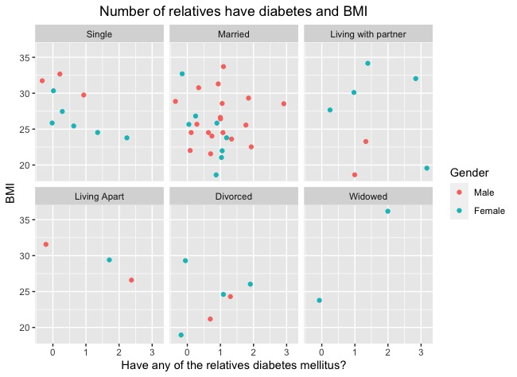
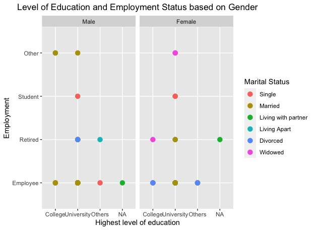

# DANCE Project

## About this project
Our study is designed as a cross sectional study. All the baseline data were collected from DANCE (Diabetes ANd CarohydratEs) study which is a randomized control trial aiming to contribute to an evidence based dietary recommendation for type-1 Diabetes patients. DANCE study compares the effect of traditional diabetic diet, moderately low carbohydrate diet and very low carbohydrate diet (not ketogenic diet) on insulin requirements in the patients with T1DM also glycemic variability and metabolic control. With the data from DANCE study, we will describe the baseline dietary habits of a group of adults with type 1 diabetes and investigate the association between quality and quantity of carbohydrates and baseline glycemic markers. We have followed a validated FFQ to get the information on the quality and quantity of the carbohydrate and the association with glycemic marker was assessed by blood sample of the adults with T1DM.

## My research aim
Investigate the association between quality of carbohydrates include glycemic index, and baseline glycemic markers in Stockholm T1DM population
Three sub areas of this aim
1. Create the baseline characteristics of the study population
2. Investigate the quality of carbohyrdates and T1DM patients by using different statistical models
3. Find the potential correlation/ models in terms of the quantity of carbohyrdates in T1DM patients

### Study Population
A total of 65 type 1 diabetes patients were recruited from Akademiskt specialistcentrum, Solna, Stockholm 
In total of (1)	55/65 participants were selected based on the active CGM time 28 days (more than 60% per day)

The following codes and graphs show the baseline characteristics of our study population

```R
ggplot(Table1_Basic_information, aes( `Year of Born`, `Duration of Diabetes/yrs`))+
  geom_jitter( aes(colour= BMI))+
  facet_wrap(.~Gender)+
  geom_smooth( method=lm, size=0.5, colour="black")+
  labs(title = "Year of born and duration of diabetes in terms of gender")
```


```R
ggplot(Table1_Basic_information, aes(`Have any of the relatives diabetes mellitus?`, BMI))+
  geom_jitter( aes(col=Gender))+ 
  facet_wrap(.~`Marital Status`)+
  labs(title = "Number of relatives have diabetes and BMI")
```



```R
ggplot(Table1_Basic_information, aes(`Highest level of education`, Employment))+ 
  geom_point( aes(col= `Marital Status`), size=3)+
  facet_wrap(.~Gender)+
  labs(title = "Level of Education and Employment Status based on Gender")
  ```
  
  
  

```R
ggplot(Excl_Quality, aes (`HbA1c (mmol/mol)`, `Wholegrain total (g)`,)) + 
  geom_boxplot(aes(group=1))+
  geom_point( aes(colour= BMI))+ 
  facet_wrap(.~Gender)+ 
  labs(title = "HbA1c VS whole grain intake in terms of BMI and Gender")
```

  
  
  ```R
ggplot(Excl_Quality, aes (`Mean sensor glucose 1 (mmol/l)`, `Wholegrain total (g)`))+
  geom_boxplot(  aes(group=1))+
  geom_point( aes(colour= BMI), size=2)+
  facet_wrap(.~Gender)+ 
  labs(title = "Blood gluocse level 28 days VS whole grain intake in terms of BMI and gender")
```


 ```R
TimeandHbformula= y~poly(x,2)
ggplot(Excl_Quality, aes(`HbA1c (mmol/mol)`, `Time in range 1 (%)`))+ 
  geom_point()+ geom_abline( linetype=3)+
  geom_smooth( formula = y~poly(x,2), method="lm", se=T, level=0.95)+
  stat_poly_eq(formula = TimeandHbformula, parse=T, size=3, colour="blue")+
  labs(title = "Time in Range for 28 days and HbA1c")
```


 ```R
ggplot(Excl_Quality, aes(`HbA1c (mmol/mol)`, `Sugar/g`))+
  geom_boxplot( aes(group=1))+geom_point( aes(colour= BMI))+
  facet_wrap(.~Gender)+
  labs(title = "HbA1c and simple sugar intake based on BMI and gender")
```


### Statistical Analysis
Since it is an ongoing project, I will not show the results but rather than codes. I will update the results afterwards.

```R
Excl_Quality_Male<- Excl_Quality[Excl_Quality$Gender=="Male",]
Excl_Quality_Female<- Excl_Quality[Excl_Quality$Gender=="Female",]
```

This is the basic linear regression model for hba1c and selected variables
```R
lmhb<-lm( `HbA1c (mmol/mol)`~ `Duration of Diabetes/yrs`+
            Gender+ BMI+`Sugar/g`+ `Wholegrain total (g)`+`Energy (kcal)`,
          data= Excl_Quality)
summary(lmhb)

vif (lmhb)
confint(lmhb)
coef(lmhb)
predict(lmhb)

plot(lmhb,1)
plot(lmhb,2) 
plot(lmhb,3)
plot(lmhb,4)
```


This part look at is there any gender differences

 ```R
lmhbfemale<-lm( `HbA1c (mmol/mol)`~  `Sugar/g`+BMI+ `Energy (kcal)` , data= Excl_Quality_Female)
summary(lmhbfemale)

lmhbmale<-lm( `HbA1c (mmol/mol)`~ `Sugar/g`
              +BMI+ `Energy (kcal)` , data= Excl_Quality_Male)
summary(lmhbmale)
```

Linear Regression model for time in range (%) 28 days and selected variables

```R
lmtime<-lm( `Time in range 1 (%)`~ `Duration of Diabetes/yrs`+
              Gender+ BMI+`Sugar/g`+ `Wholegrain total (g)`+`Energy (kcal)`, data= Excl_Quality)
summary(lmtime)

vif (lmtime)
confint(lmtime)
coef(lmtime)
predict(lmtime)

plot(lmtime,1)
plot(lmtime,2) 
plot(lmtime,3)
plot(lmtime,4)
```


I also look at other independent factors (y) such as means sensor gluocse 28 days and its SD and CV with the same format


