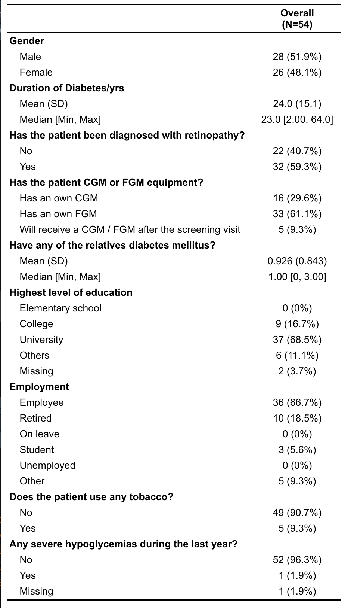
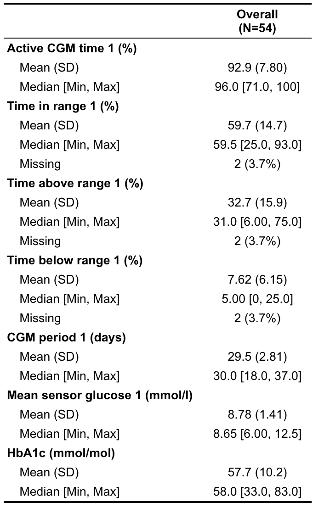
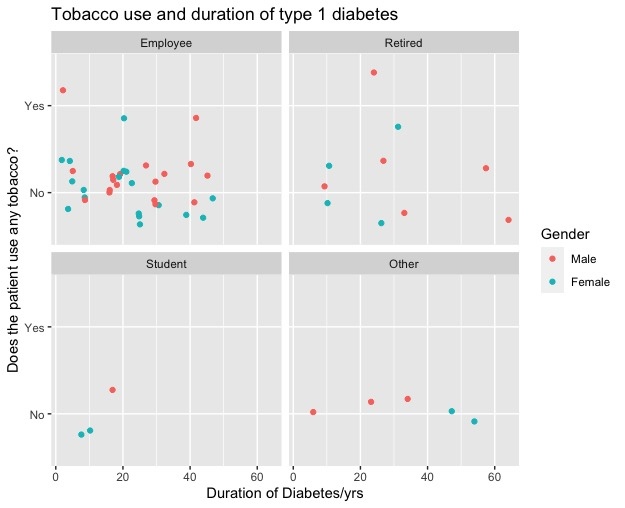
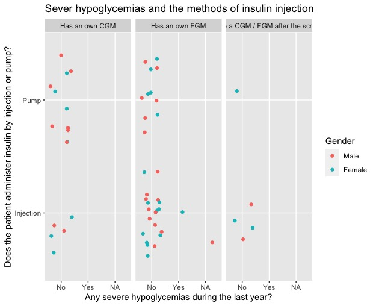
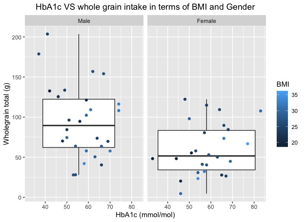
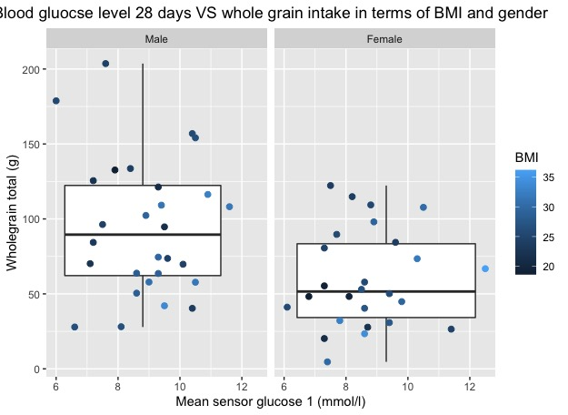
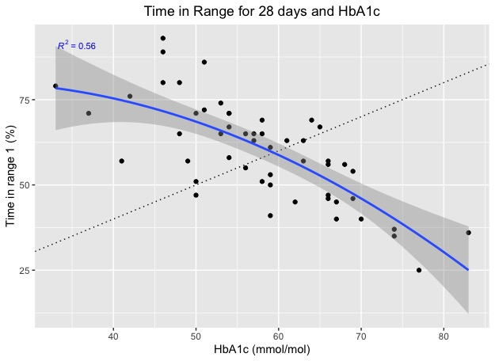
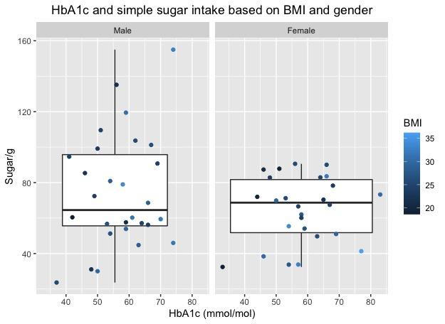
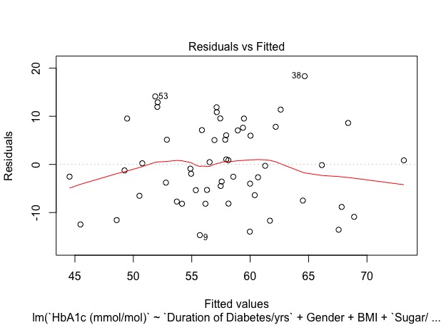
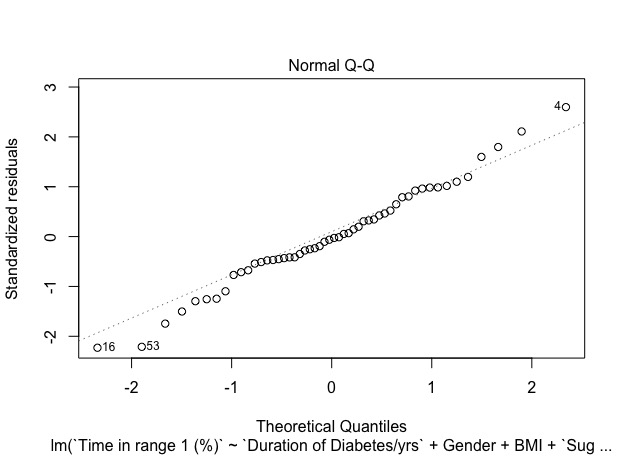

# DANCE Project

## About this project

Type 1 diabetes mellitus (T1DM) is a type of autoimmune disease characterized by increased blood glucose level due to the inability of producing insulin. Patients need regular insulin injections and usually monitor their blood glucose level continuously. Glucose intake significantly affects the blood glucose level related to the daily dietary intake. This cross-sectional study compared dietary intake between T1DM patients participating in the DANCE study at Center for Diabetes in Stockholm and the general Swedish population. A validated FFQ was filled by 65 participants to investigate the food habits. The mean intake of different food groups was compared with the Swedish national dietary report, Riksmaten Vuxna. This comparison gave an overview of the diabetic dietary pattern. Study participants chose less refined carbohydrates, fruits, red meat, and more vegetables, poultry, and fish in comparison to the Swedish general population. We also evaluated the quality of carbohydrate intake and its relationship to glycemic variations. There is a positive correlation between sugar, wholegrain, energy intake and HbA1c, time in range, standard deviation of mean sensor glucose. 

## My research aim

(1) Describe the baseline dietary habits of a group of adults with T1DM participating in a clinical trial in Stockholm and compare them with the habits of the general Swedish population 

(2) Investigate the association between quality of carbohydrates including glycemic index, and baseline glycemic markers in the same population. 

### Study Population
A total of 65 type 1 diabetes patients were recruited from Akademiskt specialistcentrum, Solna, Stockholm 
In total of 55/65 participants were selected based on the active CGM time 28 days (more than 60% per day)

```R
table1(~ Gender + `Duration of Diabetes/yrs` + `Has the patient been diagnosed with retinopathy?` + `Has the patient CGM  or FGM equipment?`+ `Have any of the relatives diabetes mellitus?` + `Highest level of education` +
         Employment + `Does the patient use any tobacco?`+ `Any severe hypoglycemias during the last year?`, data= Table1_Basic_information)
```



```R
table1(~`Energy (kcal)` + `Protein (g)` + `Fat(g)` + 
         `Carbohydrate (g)`+ `Fibre (g)` + `Wholegrain total (g)`+
       `Sugar/g`, 
       data= Excl_Quality)
```


# Anthropometric measurement
  Weight/kg
  
  Height/cm
  
  Waist circumference (cm)
  
  Systolic blood pressure (mmHg)
  
  Diastolic blood pressure (mmHg)
  
# Criteria
  Over or equal to 20 years old.
  BMI> 18.5 kg/m2.
  No sever diseases such as kidney failures and cardiovascular diseases.
  No pregnant female or lactate female.
  Have been diagnosis T1DM for over 1 year.
  C-peptide less than 0.3 ng/ml.

The following codes and graphs show the baseline characteristics of our study population

```R
ggplot(Table1_Basic_information, aes( `Year of Born`, `Duration of Diabetes/yrs`))+
  geom_jitter( aes(colour= BMI))+
  facet_wrap(.~Gender)+
  geom_smooth( method=lm, size=0.5, colour="black")+
  labs(title = "Year of born and duration of diabetes in terms of gender")
```


```R
ggplot(Table1_Basic_information, aes( `Duration of Diabetes/yrs`, `Does the patient use any tobacco?`))+ 
  geom_jitter( aes(col=Gender))+ 
  facet_wrap(.~Employment)+
  labs(title = "Tobacco use and duration of type 1 diabetes")
```



```R
ggplot(Table1_Basic_information, aes(`Any severe hypoglycemias during the last year?`, `Does the patient administer insulin by injection or pump?`))+
  geom_jitter( aes(colour=Gender))+ 
  facet_wrap(.~`Has the patient CGM  or FGM equipment?`)+
  labs(title = "Sever hypoglycemias and the methods of insulin injection")
  ```
  
  
  
### Food Intake and biomarkers
```R
ggplot(Excl_Quality, aes (`HbA1c (mmol/mol)`, `Wholegrain total (g)`,)) + 
  geom_boxplot(aes(group=1))+
  geom_point( aes(colour= BMI))+ 
  facet_wrap(.~Gender)+ 
  labs(title = "HbA1c VS whole grain intake in terms of BMI and Gender")
```

  
  
  ```R
ggplot(Excl_Quality, aes (`Mean sensor glucose 1 (mmol/l)`, `Wholegrain total (g)`))+
  geom_boxplot(  aes(group=1))+
  geom_point( aes(colour= BMI), size=2)+
  facet_wrap(.~Gender)+ 
  labs(title = "Blood gluocse level 28 days VS whole grain intake in terms of BMI and gender")
```



 ```R
TimeandHbformula= y~poly(x,2)
ggplot(Excl_Quality, aes(`HbA1c (mmol/mol)`, `Time in range 1 (%)`))+ 
  geom_point()+ geom_abline( linetype=3)+
  geom_smooth( formula = y~poly(x,2), method="lm", se=T, level=0.95)+
  stat_poly_eq(formula = TimeandHbformula, parse=T, size=3, colour="blue")+
  labs(title = "Time in Range for 28 days and HbA1c")
```


 ```R
ggplot(Excl_Quality, aes(`HbA1c (mmol/mol)`, `Sugar/g`))+
  geom_boxplot( aes(group=1))+geom_point( aes(colour= BMI))+
  facet_wrap(.~Gender)+
  labs(title = "HbA1c and simple sugar intake based on BMI and gender")
```


## Statistical Analysis 
## Since it is an ongoing project, I will NOT show the results but rather than codes

### 28 days result from CGM period 1 to evaluate the quality of carbs

```R
Excl_Quality_Male<- Excl_Quality[Excl_Quality$Gender=="Male",]
Excl_Quality_Female<- Excl_Quality[Excl_Quality$Gender=="Female",]
```

This is the basic linear regression model for hba1c and selected variables
```R
lmhb<-lm( `HbA1c (mmol/mol)`~ `Duration of Diabetes/yrs`+
            Gender+ BMI+`Sugar/g`+ `Wholegrain total (g)`+`Energy (kcal)`,
          data= Excl_Quality)
summary(lmhb)

vif (lmhb)
confint(lmhb)
coef(lmhb)
predict(lmhb)

plot(lmhb,1)
plot(lmhb,2) 
plot(lmhb,3)
plot(lmhb,4)
```




This part look at is there any gender differences

 ```R
lmhbfemale<-lm( `HbA1c (mmol/mol)`~  `Sugar/g`+BMI+ `Energy (kcal)` , data= Excl_Quality_Female)
summary(lmhbfemale)

lmhbmale<-lm( `HbA1c (mmol/mol)`~ `Sugar/g`
              +BMI+ `Energy (kcal)` , data= Excl_Quality_Male)
summary(lmhbmale)
```

Linear Regression model for time in range (%) 28 days and selected variables

```R
lmtime<-lm( `Time in range 1 (%)`~ `Duration of Diabetes/yrs`+
              Gender+ BMI+`Sugar/g`+ `Wholegrain total (g)`+`Energy (kcal)`, data= Excl_Quality)
summary(lmtime)

vif (lmtime)
confint(lmtime)
coef(lmtime)
predict(lmtime)

plot(lmtime,1)
plot(lmtime,2) 
plot(lmtime,3)
plot(lmtime,4)
```




I also look at other independent factors (y) such as means sensor gluocse 28 days and its SD and CV with the same format


### 14 days result from CGM period 2 to evaluate the quality of carbs 
### We mainly focus on 28 days result but for the comprehensive purpose we also look at 14 days result 

```R
lm2hb<-lm( `HbA1c (mmol/mol)`~`Duration of Diabetes/yrs`+ Gender+BMI+ `Sugar/g`+`Wholegrain total (g)`+
             `Energy (kcal)`, data= Excl_activecgm2)
summary(lm2hb)

lm2hbfemale<-lm( `HbA1c (mmol/mol)`~ 
                  `Wholegrain total (g)`
                +BMI+ `Energy (kcal)` , data= Excl_activecgm2_Female)
summary(lm2hbfemale)

lm2hbmale<-lm( `HbA1c (mmol/mol)`~ `Wholegrain total (g)`
              +BMI+ `Energy (kcal)` , data= Excl_activecgm2_Male)
summary(lm2hbmale)
```

```R
lm2time<-lm( `Time in Range 2 (%)`~`Duration of Diabetes/yrs`+ Gender+BMI+ `Sugar/g`+`Wholegrain total (g)`+
             `Energy (kcal)`, data= Excl_activecgm2)
summary(lm2time)

lm2timefemale<-lm( `Time in Range 2 (%)`~ 
                   `Wholegrain total (g)`
                 +BMI+ `Energy (kcal)` , data= Excl_activecgm2_Female)
summary(lm2timefemale)

lm2timemale<-lm( `Time in Range 2 (%)`~ `Wholegrain total (g)`
               +BMI+ `Energy (kcal)` , data= Excl_activecgm2_Male)
summary(lm2timemale)
```

```R
lm2mean<-lm( `Mean sensor glucose 2 (mmol/l)`~`Duration of Diabetes/yrs`+ Gender+BMI+
               `Sugar/g`+`Wholegrain total (g)`+
             `Energy (kcal)`, data= Excl_activecgm2)
summary(lm2mean)

lm2meanfemale<-lm( `Mean sensor glucose 2 (mmol/l)`~ 
                     `Wholegrain total (g)`
                   +BMI+ `Energy (kcal)` , data= Excl_activecgm2_Female)
summary(lm2meanfemale)

lm2meanmale<-lm( `Mean sensor glucose 2 (mmol/l)`~ `Wholegrain total (g)`
                 +BMI+ `Energy (kcal)` , data= Excl_activecgm2_Male)
summary(lm2meanmale)
```


