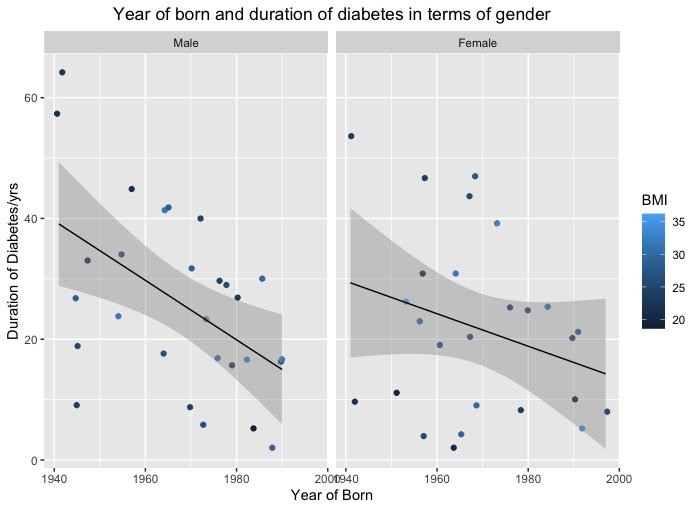

# DANCEProject
## Introduction

About this project
Dietary intake and glycemic markers in Stockholm adults with type 1 diabetes: cross-sectional analysis using baseline parameters from the DANCE-study
My research aim
Investigate the association between quality of carbohydrates include glycemic index, and baseline glycemic markers in Stockholm T1DM population
Three sub areas of this aim
1. Create the baseline characteristics
2. Investigate the quality of carbohyrdates and T1DM patients by using different statistical models
3. Find the potential correlation/ models in terms of the quantity of carbohyrdates in T1DM patients

## Study Population
```R
ggplot(Table1_Basic_information, aes( `Year of Born`, `Duration of Diabetes/yrs`))+
  geom_jitter( aes(colour= BMI))+
  facet_wrap(.~Gender)+
  geom_smooth( method=lm, size=0.5, colour="black")+
  labs(title = "Year of born and duration of diabetes in terms of gender")
```



